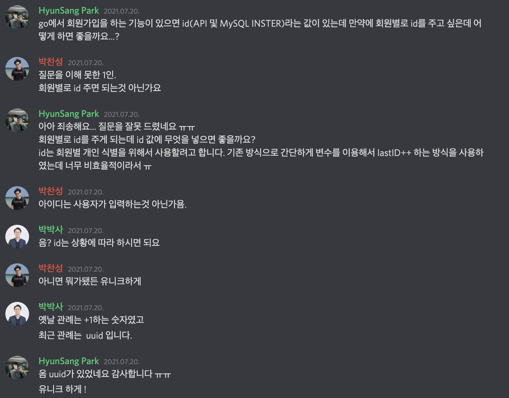
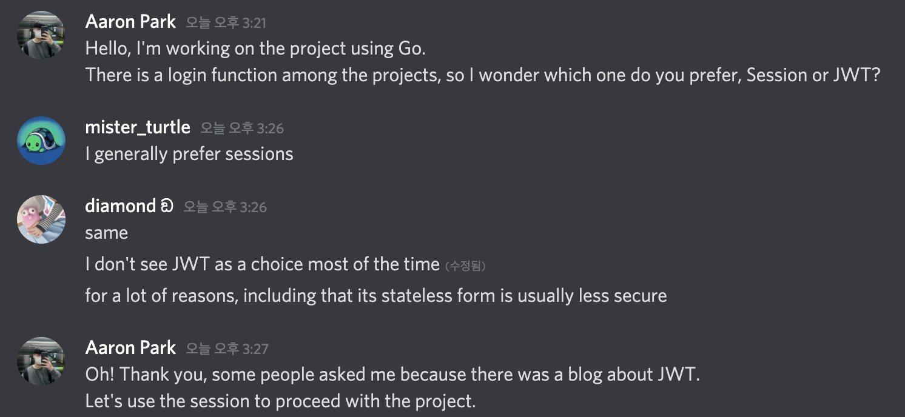

# Go-Login
> 본 프로젝트는 기본적인 로그인과 회원가입에 대해서 공부하고 개발하는 프로젝트입니다.

본 프로젝트의 커밋 메시지 규칙은 [Conventinal Commit Messages](https://gist.github.com/qoomon/5dfcdf8eec66a051ecd85625518cfd13)를 따릅니다.

## 🚀 TODO:
### BackEnd
- [X] Render Handler | GET - 2021.07.19
    - `index.html` 완료 - 2021.07.19
    - `login.html` 완료 - 2021.07.19
    - `register.html` 완료 - 2021.07.19
- [X] `/register/new` POST: - 2021.07.19
    - [X] MySQL 연결 및 Table 구축
    - [X] `uuid` 패키지를 이용하여 `UUIDv4`로 개인별 ID 부여
    - [X] `bcrypt` 패키지를 이용하여 패스워드 암호화
    - [X] API 요청 및 응답 구성 
- [ ] `/login` POST: 
    - [X] MySQL 연결  - 2021.07.22
    - [ ] 입력된 값과 DB에 저장되어 있는 값과 대조 / MySQL & `bcrypt`
    - [ ] JMT 구성으로 입력된 값과 DB에 저장되어 있는 값을 대조 후 JMT Token 생성
    - [ ] API 요청 및 응답 구성

- [ ] Infrastructure
    - [X] Docker 기반의 MySQL 서버 구축 - 2021.07.19
        - [X] Table Users 설계 및 구축
    - [ ] Docker 기반의 Golang BackEnd 서버 구축

### FrontEnd
- [X] Register
    - [X] `/register/new`: 회원가입 요청하기
- [ ] Login
    - [ ] `/login`: 로그인 요청하기

## 기본 설정
### `.env` 설정하기
- `DB_ACCOUNT`: MySQL 계정
- `DB_HOST`: MySQL 주소
- `DB_PASSWORD`: MySQL 비밀번호
- `DB_NAME`: DataBase 이름

```env
DB_ACCOUNT=
DB_HOST=
DB_PASSWORD=
DB_NAME=
```

### DataBase Structure
```sql
create  database go_login default character set utf8;
create table Users (
    ID  BINARY(36) primary key ,
    FirstName varchar(3) not null,
    LastName varchar(5) not null,
    Email varchar(320) not null,
    Password char(60) not null,
    CreatedAt Timestamp
);
```

## 기능
무엇이 더 효과적으로 개발할 수 있고 가독성 좋은 API를 만들어야 하는지에 대해서 고민하고 있습니다.

### 회원가입
```json
// Reqeust http://localhost:3000/register/new | GET
{
    "first_name": "박",
    "last_name": "현상",
    "email": "hyun.sang@parkhyunsang.com",
    "password": "parkhs0625"
}

// Respone
{
    "ID": "d2d76623-fd96-42bb-a11d-04677baf453d", // UUIDv4
    "first_name": "박",
    "last_name": "현상",
    "email": "hyun.sang@parkhyunsang.com",
    "password": "$2a$10$3QRdPhyeA0Dgxm.mhFqEkO/7Ok02WJZMq8NkYNdqPp9Kf2LBrnURC", // Encryption
    "created_at": "2021-07-20T23:25:11.551493+09:00" // CreateAt | time.Now()
}
```

## 오류(고민) 해결기
### ID?

사용자마다 다른 아이디를 생성하여서 고유 식별이 가능하도록 하여야 하는데 어떻게 해야할지 고민하던 중 코딩냄비에 질문을 해 본 결과 UUID를 사용하면 좋다고 해서 사용하게 됨.

### Session vs JWT 

로그인 이후 관리를 어떻게 해야하는지 궁금해서 Discrod Gophers에 질문을 해 본 결과 보편적으로 사용하고 있는 방식은 Seesion 방식을 많이 사용하고 있다고 하여서 Seesion을 사용하기로 함.